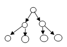
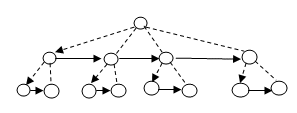

### Задача 🌲 

Реализовать класс, задающий конструкцию "бинарное дерево" 
и функцию вычисления высоты бинарного дерева,
если каждый узел дерева задан вершиной и двумя поддеревьями.

### Задача 2 🌳

Реализовать класс, задающий конструкцию "дерево" и 
функцию вычисления высоты дерева, если каждый узел дерева задан
вершиной и двумя ссылками: на соседнюю вершину ("брата") того же
уровня и первую вершину ("сына") нижнего уровня.

